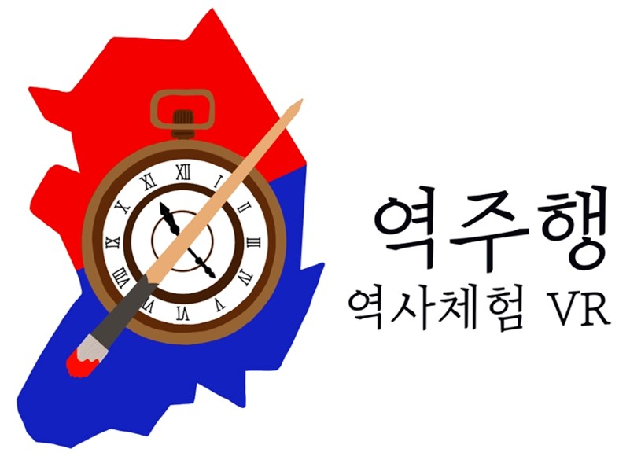
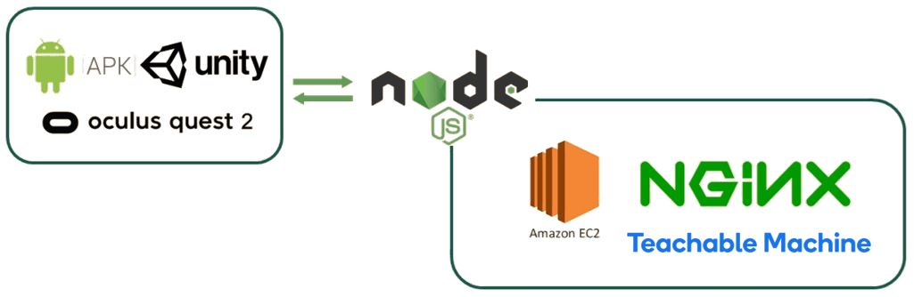

# Reverse(역주행) - 역사의 주인공이 되는 여행

> 일제강점기 3.1 운동 시대 배경의 VR 역사 체험 교육 플랫폼

Oculus Quest2 VR 하드웨어 전용 어플리케이션으로, Open Brush 3D 그림 기능을 통해 학생들의 몰입감과 흥미도를 유발하고, 어플리케이션 경험 속 자연스러운 역사 인물 및 도구에 대한 학습을 유도하는 역사 체험 교육 플랫폼입니다.

## 🎲 주요 기능

- 오큘러스 퀘스트2 기반의 실감나는 VR 환경 체험
- 일제강점기 시대 주요 인물 및 도구들에 대한 설명을 통해 자연스럽게 역사 학습
- 자유로운 브러쉬 기능을 통한 3D 환경 속 그림 그리기 체험
- 시나리오 이어하기 기능 및 스테이지 별 데모 시연 기능

## 🎆 세부 기능

| 구분 |                 기능                  |                             설명                             | 비고 |
| :--: | :-----------------------------------: | :----------------------------------------------------------: | :--: |
|  1   | 브러시 기능을 통한 태극기 그리기 학습 | 태극기 점선 가이드를 따라 태극기를 직접 그려보고, 잘 그려졌는지 머신러닝 서버에서 판단 |      |
|  2   |       일제강점기 시대 배경 체험       |        1919년 서울과 사람들의 모습을 VR 환경에서 체험        |      |
|  3   |   시대 중요 인물 및 물건 정보 확인    | 중요 인물 및 물건에 가까이 이동하면 해당 오브젝트의 이름이 표시되고, 상호작용 하여 상세 정보를 확인 |      |

## 🔨 아키텍처

## 💿 설치 및 실행

1. Git clone
2. [추가 에셋 드라이브](https://drive.google.com/drive/folders/1SXOdj1nNNBppHeIJYEuLVrFue_Si9oLP?usp=sharing) 에서 `HistoryEdu` & `Shaders` & `Oculus` 폴더를 다운로드 받아 /Assets/ 경로에 붙여넣습니다.
3. Unity를 실행합니다. (Unity 2019.4.25f1)
4. File > Open Scene.
5. `/Assets/Scenes/Main.unity` 를 선택한 뒤, `TextMesh Pro`를 Import합니다.
6. `Import TMP Essentials`를 선택합니다. `Window > TextMesh Pro > Import TMP Essential Resources` 의 방법을 사용할 수 있습니다.
7. Play 버튼을 누르면 재생됩니다.

## 🎨 사용 예시

##### 브러시 및 지우개 사용

##### 태극기 그리기

##### 역사적 배경 체험

🟣 VR 환경에서 구현된 역사적 배경 및 인물, 도구 직접 체험

🟣 Open Brush 및 자체 개발 그림 그리기 기능을 통한 흥미도 및 몰입감 유발

🟣 가이드가 포함된 태극기 그리기 체험

🟣 자연스러운 역사 지식 학습

## 💻 개발 설정 및 빌드

1. Player Settings의 Player 설정을 변경합니다.
   - Other Settings
     - Rendering > Color Space > Gamma
     - Graphics APIs > OpenGLES3
     - Static Batching, Dynamic Batching 체크
   - XR Settings
     - Virtual Reality Supported 체크
     - Oculus > Low Overhead Mode, V2 Signing (Quest) 체크
   - Build Settings
     - Texture Compression > ASTC
2. Secrets file을 생성합니다.
   - Unity 프로젝트의 Window 창에서 루트 폴더인 `/Assets` 폴더를 마우스 오른쪽 클릭합니다. `Create` 를 선택한 뒤, `Secrets Config`를 선택합니다. Asset 폴더 내에 `Secrets.asset` 파일이 생성됩니다.
   - `Scenes/Main.unity` 에서 `App > Config` 오브젝트를 선택해 `SecretsExample` 파일을 생성한 `Secrets.asset` 파일로 교체합니다.
3. Oculus 지원을 활성화합니다.
   - `Player settings`에서 `Standalone`을 선택한 뒤, `Other Settings`의 `Scripting Define Symbols` 의 맨 뒤에 `OCULUS_SUPPORTED` 를 추가 작성합니다. 작성되는 Symbols는 세미콜론으로 구분합니다.
   - `Player settings`에서 `Android`를 선택한 뒤, `Other Settings`의 `Scripting Define Symbols` 의 맨 뒤에 `OCULUS_SUPPORTED` 를 추가 작성합니다. 작성되는 Symbols는 세미콜론으로 구분합니다.
4. Oculus App을 Build 합니다.
   - Unity 도구
     - Tilt > Build > SDK: OVR
     - Tilt > Build > Platform: Android
     - Tilt > Build > Runtime: Mono
   - 빌드를 실행합니다. Tilt > Build > Do Build.
   - 빌드된 apk 파일은 `../Builds/OculusMobile_Release_OpenBrush_FromGui/` 아래 생성됩니다.
   - Note : `Do Build` 기능 사용 전에, 새롭게 추가한 Unity Scene이 있다면, 추가한 scene의 파일 이름들을 `../Assets/Editor/` 아래 `BuildTiltBrush.cs` 파일 내 DoBuild 함수 (string[] scenes = {...})의 scenes 리스트 안에 추가해야합니다.
   - Open Brush 자체 Main Scene을 사용하지 않고 수정된 Scene을 사용한다면, Do Build 기능 대신 Unity 자체 빌드 기능을 활용하는게 좋을 수 있습니다.
5. Oculus stores에 Publishing
   - Oculus로부터 어플리케이션 ID를 발급받습니다. 데스크탑과 퀘스트 어플리케이션은 각각 다른  ID가 필요합니다.
   - Secrets file을 만들고, 2 items를 Secrets field에 추가합니다.
   - ID를 `Secrets` 파일에 추가합니다.
   - 어플리케이션 ID를 `Client ID` field에 추가합니다.

## 🎮 APK파일 다운로드

- [역주행 공식 홈페이지](http://k4a101.p.ssafy.io/) (0.0.1버전, 현재 0.1.0버전)
- [SideQuest](https://www.oculus.com/experiences/quest/5393986407340561/) (0.1.0버전)

## 🧶 릴리즈 히스토리

- 0.1.0
  - Work in progress

## ⏲ 연락처

- 신상훈 - sakwook@gmail.com

## 🦴 기여

1. 해당 프로젝트를 Fork 하세요.
2. [추가 에셋](https://drive.google.com/drive/folders/1SXOdj1nNNBppHeIJYEuLVrFue_Si9oLP?usp=sharing)을 다운로드 받아 /Assets/ 경로에 붙여넣으세요.
3. feature 브랜치를 생성하세요.
4. 브랜치에 Push 하세요.
5. 새로운 Merge Request를 요청하세요.
6. 2번에서 다운로드 받은 추가 에셋 내 파일 수정 사항이 있는 경우, 드라이브를 생성하여 `HistoryEdu` & `Shaders` & `Oculus` 폴더를 공유할 수 있는 링크와, 변경 내용을 Merge Request에 함께 요청하세요.

### 라이선스

- Distributed under the SGPL license. See the [LICENSE](LICENSE) for more information.
- Tilt Brush is licensed under Apache 2.0. It is not an officially supported Google product.

