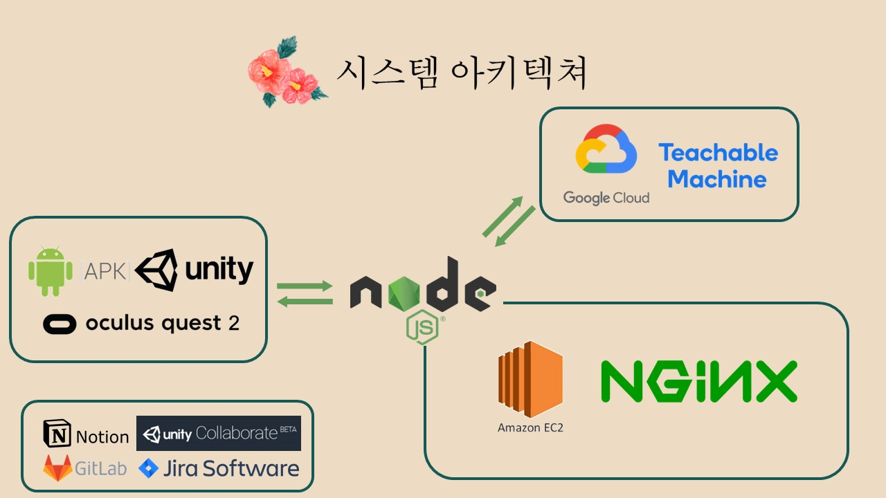

# 역주행 (TEAM A101)

> 🎓 역사체험 VR 프로젝트
>
> ⏲ [역사속 주인공 여행](http://k4a101.p.ssafy.io/)

### 👨‍👩‍👦‍👦 Members 

 

### 💾 Usage

- #### APK 파일 설치

  1. Oculus Side Quest를 통해서 App을 설치합니다 
  2. 설치가 완료가 되었다면 Oculus Quest App창을 실행시킵니다
  3. 오른쪽 상단 탭을 이용해 '알수없는 출처'로 탭합니다
  4. 역주행(Reversingthetime) APK 파일을 다운로드 받습니다

### 🎓 Project Info

- Project Purpose

  역사 교육의 중요성을 알고 있지만 암기식의 역사공부 방법이 어려운 사람들을 위해 좀 더 효과적인 역사 교육 컨텐츠를 제공하기 위해 이 프로젝트를 진행했습니다
  
  역사속 배경에서 주인공이 되어 여행을 하면서 역사교육을 자연스럽게 배울 수 있게 제작했습니다
  
- Duration

  April 12th 2021 ~ May 28th 2021

- Tech Stack

  

### 🧭 Project Detail

- Start Scene

  

- Preview Scene

  

- Main Scene

- Prison Scene

  

- Drawing Scene

  

- Ending Scene

  

### 💬 Tech log 

Develop Summary

    <ul>
        <a href="Document/Tech_Log/Personal/Develop_Summary_Sanghun.md"><li>신상훈 개발일지</li></a>
        <a href="Document/Tech_Log/Personal/Develop_Summary_HaeSung.md"><li>강해성 개발일지</li></a>
        <a href="Document/Tech_Log/Personal/Develop_Summary_SoHyun.md"><li>박소현 개발일지</li></a>
        <a href="Document/Tech_Log/Personal/Develop_Summary_JongWon.md"><li>박종원 개발일지</li></a>
        <a href="Document/Tech_Log/Personal/Develop_Summary_Mintak.md"><li>오민택 개발일지</li></a>
    </ul>

Scrum

    <ul>
       <a href="https://www.notion.so/8d8d70a0a3144a22b506a5311fbb4a07?v=79e31d4e89174a9494cbc8f33d9db4d1"><li>Notion</li></a> 
    </ul>

WireFrame

    <ul>
    <a href="Document/Scenario.md"><li>시나리오(대사)</li></a>
    </ul>

PPT

    <ul>
      <a href="Document/PPT/Final_PJT_2ndweek_PPT.pptx"><li>PPT</li></a>
    </ul>

